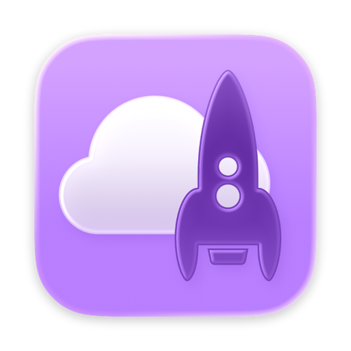
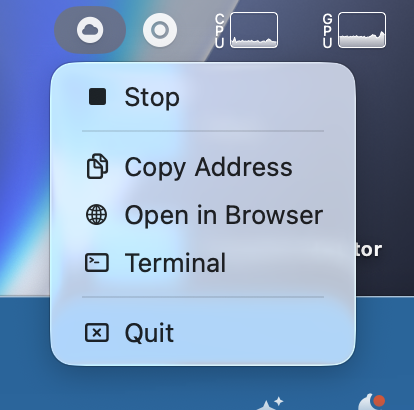

  
  <h1>Macloud</h1>
    
A minimalistic menu bar extra for macOS which fronts Docker to quickly deploy an ephemeral Nextcloud server container for client development.

    

## Who is this for?

For developers working on client apps which need to connect to a clean and local Nextcloud server quickly.

## Why?

Because I am lazy and rather click twice than type dozens of characters.
Even pulling it out of my snippet manager is too much for me.

## What does it do?

- Deploy a Nextcloud server Docker container on app launch
- Automatically does minor provisioning on container launch, mostly disabling Nextcloud server apps unnecessary unnecessary in a local test environment like the password policy
- Launch Docker Desktop, if not already running
- Stop the Nextcloud server container on app termination
- Stop or launch it again on demand
- Provide a convenience action to copy the address including port number to pasteboard
- Provide a convenience action to open a Terminal inside the container for `occ` commands

## Requirements

- macOS 26.2 Tahoe or newer
- Docker Desktop[^1]

## License

See [LICENSE](LICENSE) file.

[^1]: This was primarily tested with the official Docker Desktop app but prove to work with Orbstack, too. Probably also works with Podman or whatever takes over the `docker` command in your command line environment.